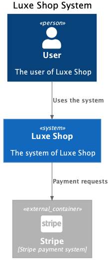
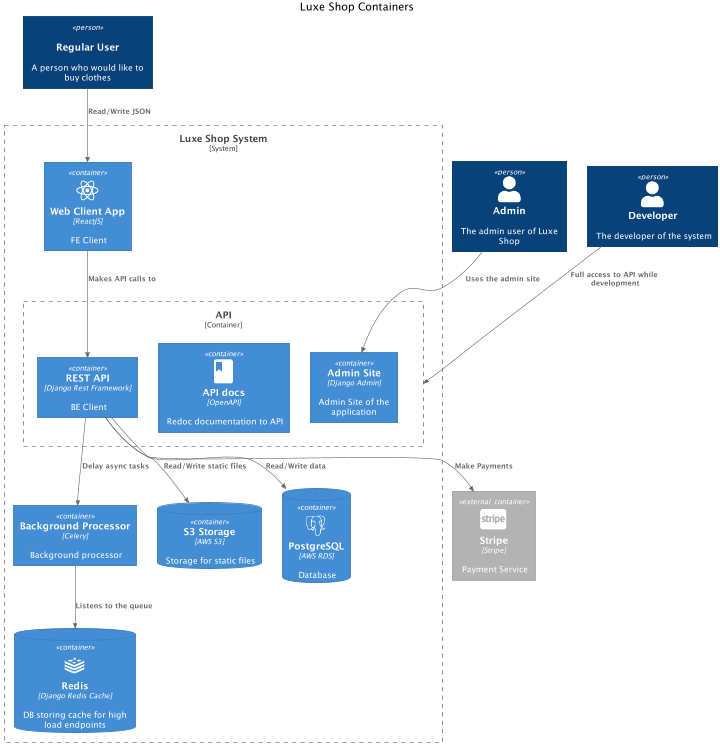

# LUXE SHOP

### Project description

LUXE is the online clothes shop.
* Search and add products to cart.
* Order products.
* Personal profile page.

### Runtime environment

The infrastructure of LUXE project consists of the following services:
* PostgreSQL database
* Django-Redis-Cache for processing high load endpoints
* AWS EC2 for API
* AWS S3 for React App and assets
* AWS RDS for database
* Stripe for processing payments

### Development environment

Steps to run application locally:
1. Clone the project
2. `cd luxe`
3. `pip install pipenv`
4. `pipenv install`
5. `pipenv shell`
6. `docker-compose -f docker-compose-dev.yaml up --build`
7. `python manage.py migrate`
8. `python manage.py runserver`

### Test environment
How to run tests.
* `python manage.py test`

### Production deploy
Deploy consists of two parts: deployment of backend and frontend.
In order to deploy the backend:
1. Connect to EC2 instance via SSH.
2. `cd luxe-shop`
3. `git pull origin main`

In order to deploy the frontend:
1. `cd luxe-ui`
2. `npm run build`
3. `npm run deploy`

### System. The First Level

### Containers. The Second Level
